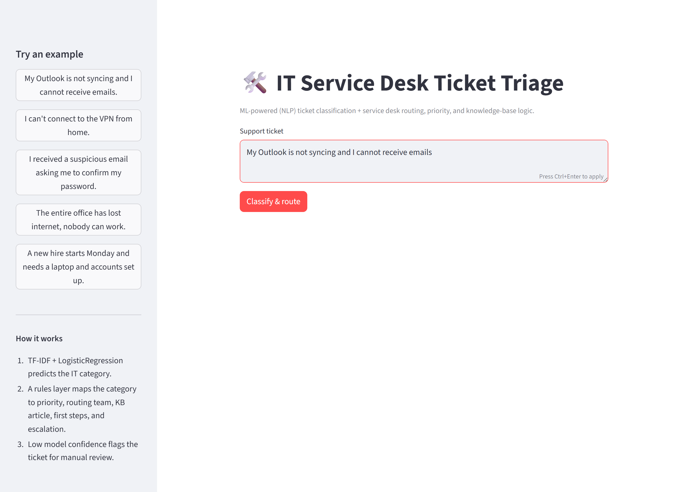
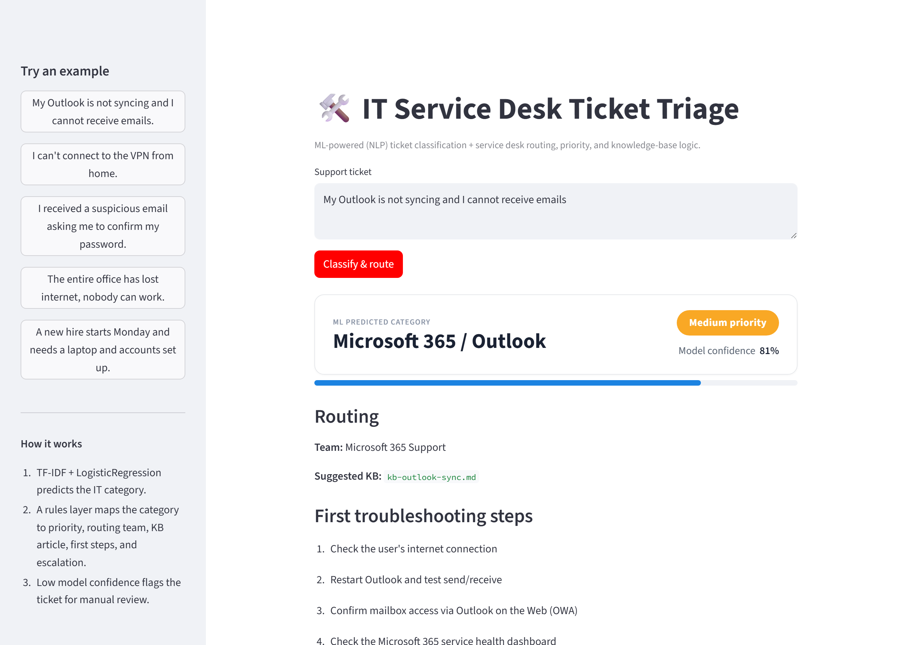
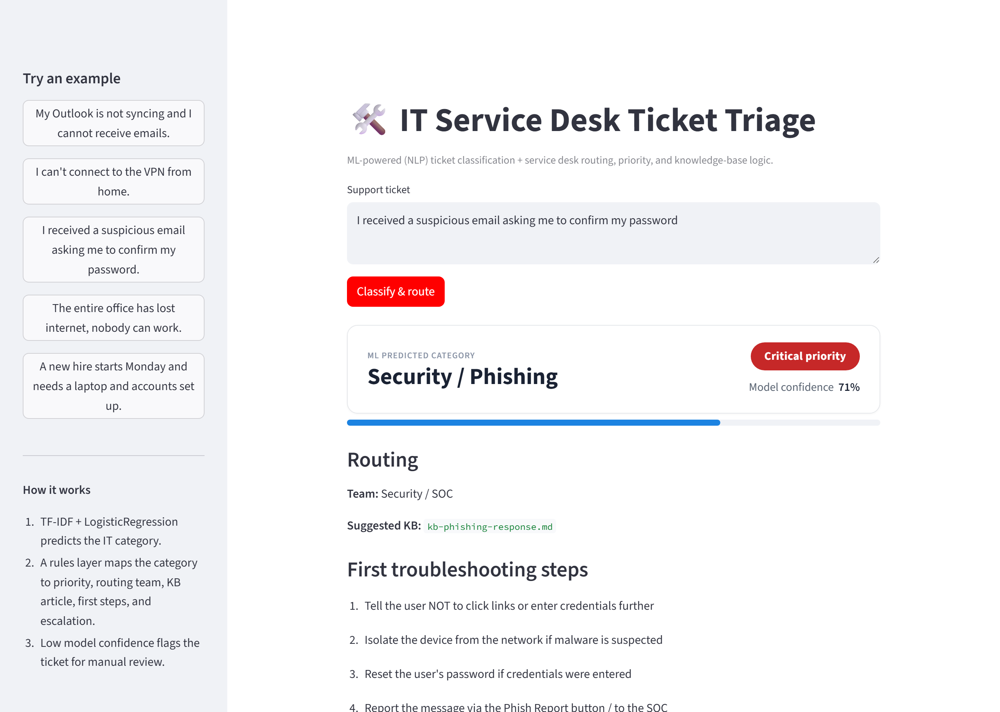

# IT Service Desk Ticket Classification & Routing System


An **ML-powered IT service desk tool**. It uses **NLP (TF-IDF + Logistic
Regression)** to classify free-text IT support tickets into service desk
categories, then applies **service desk logic** on top of the model's prediction
to decide **priority, routing team, a suggested knowledge-base article, first
troubleshooting steps, and an escalation recommendation** — simulating how a real
Help Desk / Service Desk triages and routes tickets.

> Built an ML-powered IT service desk classifier that uses NLP to categorize
> support tickets, then applies routing, priority, and knowledge-base logic to
> simulate real service desk triage.

The **machine learning model is the core** of the project. The **IT workflow
layer** wraps the prediction so it's useful for Help Desk, Service Desk Analyst,
Technical Support, and IT Operations roles.



## What this project combines

- **Machine learning / NLP** — text classification with TF-IDF + Logistic Regression
- **Ticket classification** — 15 real IT service desk categories
- **IT service desk workflow** — turns a prediction into an actionable triage
- **Priority & routing logic** — priority level and the team that should own the ticket
- **Knowledge base recommendations** — a suggested KB article per category
- **Support operations thinking** — first troubleshooting steps and escalation rules

## How it works

```
   Free-text ticket
"My Outlook is not syncing and I cannot receive emails."
          │
          ▼
┌───────────────────────────┐
│   ML / NLP  (the core)     │   src/preprocessing.py  → clean text
│   TF-IDF  +  LogisticReg   │   src/model.py / train.py → predict category
└───────────────────────────┘
          │  predicted category + confidence
          ▼
┌───────────────────────────┐
│  Service desk workflow     │   src/service_desk.py
│  layer (rules)             │   priority · routing · KB · steps · escalation
└───────────────────────────┘
          │
          ▼
   Actionable triage (see example below)
```

- **The ML model predicts the category.** (This is the learned, data-driven part.)
- **The service desk layer applies rules** to derive priority, routing team, KB
  article, first steps, and escalation — plus it uses the model's **confidence**
  to flag low-confidence tickets for manual review.

## Worked example

**Input:** `My Outlook is not syncing and I cannot receive emails.`

**Output:**

| Field | Value |
|-------|-------|
| **ML Predicted Category** | Microsoft 365 / Outlook |
| **Confidence** | 0.81 |
| **Priority** | Medium |
| **Routing Team** | Microsoft 365 Support |
| **Suggested KB** | `kb-outlook-sync.md` |
| **First Steps** | Check internet · restart Outlook · test Outlook on the Web · confirm mailbox access |
| **Escalation** | Escalate to Messaging/Exchange if mailbox access fails in OWA or multiple users are affected |

## Demo

The Streamlit app (`it_service_desk_demo.py`) shows the full triage for any
ticket: the ML prediction and confidence, the priority, the routing team, the
suggested KB article, first troubleshooting steps, and the escalation guidance.

**Medium-priority example — routed to Microsoft 365 Support:**



**Critical-priority example — a phishing report routed to the Security / SOC team:**



## IT categories

The ML model classifies each ticket into one of these 15 categories, and each maps
to a service desk rule (`src/service_desk.py`):

| Category | Priority | Routing team | Suggested KB |
|----------|----------|--------------|--------------|
| Password Reset | Low | Service Desk (Tier 1) | `kb-password-reset.md` |
| Account Lockout | Medium | Service Desk (Tier 1) | `kb-account-lockout.md` |
| Microsoft 365 / Outlook | Medium | Microsoft 365 Support | `kb-outlook-sync.md` |
| Teams / OneDrive | Medium | Microsoft 365 Support | `kb-teams-onedrive.md` |
| Network / Wi-Fi | High | Network Operations | `kb-network-wifi.md` |
| VPN | High | Network Operations | `kb-vpn-connectivity.md` |
| Printer | Low | Service Desk (Tier 1) | `kb-printing.md` |
| Hardware | Medium | Desktop Support | `kb-hardware-troubleshooting.md` |
| Software Installation | Low | Desktop Support | `kb-software-install.md` |
| Access Request | Medium | Identity & Access Management | `kb-access-request.md` |
| Shared Folder | Medium | Identity & Access Management | `kb-shared-folder-access.md` |
| Security / Phishing | Critical | Security / SOC | `kb-phishing-response.md` |
| New Hire Setup | Medium | IT Onboarding | `kb-new-hire-setup.md` |
| Offboarding | High | IT Onboarding | `kb-offboarding.md` |
| Escalation Required | Critical | Major Incident / On-call | `kb-major-incident.md` |

## Quick start (the demo)

```bash
# 1. Install dependencies
pip install -r requirements.txt

# 2. Run the CLI demo (trains the model automatically on first run)
python demo.py
```

More ways to run the demo:

```bash
python demo.py "My VPN won't connect from home"   # triage a single ticket
python demo.py --interactive                       # type tickets live
python demo.py --retrain                           # retrain the model first
```

Optional Streamlit demo (paste a ticket, see the full triage):

```bash
streamlit run it_service_desk_demo.py
```

## The machine learning pipeline

The ML core lives in a few small, readable modules:

| Step | Where | What it does |
|------|-------|--------------|
| **Dataset** | `data/raw/it_support_tickets.csv` | 210 labelled IT tickets across the 15 categories (`text,label`) |
| **Preprocessing** | `src/preprocessing.py` | Lowercase, strip, collapse whitespace |
| **Vectorization** | `src/preprocessing.py` | **TF-IDF** with unigrams + bigrams, English stop words |
| **Model** | `src/model.py`, `src/train.py` | **LogisticRegression** (multi-class) |
| **Train/test split** | `src/data_loader.py` | Stratified 70% / 15% / 15% train / val / test |
| **Evaluation** | `src/evaluation.py` | Accuracy, macro / weighted **F1**, per-class metrics, confusion matrix |
| **Prediction** | `src/model.py` | `classify()` and `classify_and_triage()` |

**Prediction function** (the one the demos call):

```python
from src.model import classify_and_triage

result = classify_and_triage("I can't connect to the VPN from home")
# {
#   'predicted_category': 'VPN',
#   'confidence': 0.78,
#   'priority': 'High',
#   'routing_team': 'Network Operations',
#   'suggested_kb': 'kb-vpn-connectivity.md',
#   'first_steps': [...],
#   'escalation': '...',
#   'needs_review': False,
# }
```

### Model performance

On the held-out **test split** (15-class problem, ~210 total samples):

- **Accuracy:** ~0.72
- **Macro-F1:** ~0.66

These are honest numbers for a small, deliberately simple and explainable
dataset. Most misclassifications are between naturally overlapping categories
(e.g. *Password Reset* vs *Account Lockout*, or *Escalation Required* vs the
specific outage type). The **confidence score** is used by the service desk layer:
tickets below a confidence threshold are flagged `needs_review` so a human analyst
confirms the category before auto-routing.

Retrain any time:

```bash
python -m src.model     # trains and saves models/classifier.pkl + vectorizer.pkl
```

## Tests

Simple, fast tests cover both the ML classifier and the service desk rules:

```bash
pytest tests/ -v
```

- `tests/test_model.py` — clear tickets classify into the right category; end-to-end triage works
- `tests/test_service_desk.py` — every category has a complete rule; routing, priority, and low-confidence review flag behave correctly

## Project structure

```
mlops-support-ticket-classifier/
├── data/raw/
│   └── it_support_tickets.csv      # IT ticket dataset (text, label)
├── src/
│   ├── config.py                   # Categories (LABELS) + paths
│   ├── data_loader.py              # Load + stratified train/val/test split
│   ├── preprocessing.py            # Text cleaning + TF-IDF vectorizer
│   ├── model.py                    # Self-contained train / load / classify + triage
│   ├── service_desk.py             # ★ Service desk workflow layer (rules)
│   ├── train.py                    # Full MLflow training pipeline
│   ├── evaluation.py               # Metrics + confusion matrix
│   ├── inference.py                # MLflow model loading + prediction
│   ├── drift_detection.py          # Simple data drift detection
│   └── api/                        # FastAPI serving layer
├── demo.py                         # ★ CLI demo (ML prediction + triage)
├── it_service_desk_demo.py         # ★ Streamlit demo
├── tests/                          # ★ Model + service desk tests
├── dashboard/                      # Streamlit ops/monitoring dashboard
├── monitoring/                     # Prometheus + Grafana
├── docker/ , docker-compose.yml    # Full-stack containerization
└── requirements.txt
```

(★ = added/changed to turn the classifier into an IT service desk tool.)

## The IT service desk workflow layer

`src/service_desk.py` is the layer that makes the ML prediction operationally
useful. It's intentionally **rule-based and easy to read** — the kind of triage
logic a real service desk encodes in its ITSM tool, kept here in one transparent
dictionary:

```python
"Microsoft 365 / Outlook": {
    "priority": "Medium",
    "routing_team": "Microsoft 365 Support",
    "kb_article": "kb-outlook-sync.md",
    "first_steps": [
        "Check the user's internet connection",
        "Restart Outlook and test send/receive",
        "Confirm mailbox access via Outlook on the Web (OWA)",
        "Check the Microsoft 365 service health dashboard",
    ],
    "escalation": "Escalate to Messaging/Exchange if mailbox access fails in OWA "
                  "or multiple users are affected.",
},
```

`triage_ticket(text, predicted_category, confidence)` merges the ML prediction
with the matching rule and returns the full, actionable triage — including the
low-confidence review flag.

---

## MLOps / production stack (optional depth)

Beyond the core classifier + triage, the project also includes a full MLOps stack
so it can be run as a production-style service. This part is **optional** — the
demo above runs without it.

- **Experiment tracking & model registry:** MLflow (`src/train.py` logs params,
  metrics, and artifacts to `mlruns/`)
- **Serving:** FastAPI (`src/api/main.py`) exposes a `/predict` endpoint
- **Monitoring:** Prometheus + Grafana (request rate, latency, error rate, drift)
- **Data drift detection:** `src/drift_detection.py` compares ticket-length
  distributions between training data and live traffic
- **Containerization:** Docker + Docker Compose (`docker-compose.yml`)
- **CI/CD:** GitHub Actions (`.github/workflows/ci-cd.yml`)
- **Ops dashboard:** `dashboard/app.py` (KPIs, model quality, monitoring, drift)

### Tech stack

- **Language:** Python 3.11+
- **ML / NLP:** scikit-learn (TF-IDF + LogisticRegression)
- **Experiment tracking:** MLflow
- **API:** FastAPI + Uvicorn
- **Monitoring:** Prometheus + Grafana
- **Containers / CI:** Docker Compose + GitHub Actions

### Run the full stack

```bash
# Train and register a model with MLflow
python -m src.train

# Serve predictions
uvicorn src.api.main:app --reload      # http://localhost:8000/docs

# Or bring up the whole stack
docker-compose up --build
```

The `/predict` endpoint classifies a batch of tickets and returns the predicted
category with a confidence score:
```bash
curl -X POST "http://localhost:8000/predict" \
     -H "Content-Type: application/json" \
     -d '{"tickets": ["My Outlook is not syncing and I cannot receive emails"]}'
```

### Ops dashboard sample data

```bash
python scripts/generate_sample_logs.py --num-logs 1000   # sample inference logs
python scripts/generate_sample_reports.py                # sample metrics/report
streamlit run dashboard/app.py                           # http://localhost:8501
```

---

## Résumé bullets

- Built an **ML-powered IT ticket classifier** using NLP (TF-IDF + Logistic
  Regression) to categorize help desk issues by support type.
- Added **service desk routing logic** for priority, escalation path, support
  team, and knowledge-base recommendations on top of the model's prediction.
- Classified tickets across **Outlook, VPN, printer, account access, network,
  hardware, and security** issue categories (15 IT categories total).
- Created a **CLI/demo workflow** showing the model prediction, confidence score,
  routing team, and suggested troubleshooting steps end-to-end.
- Wrapped the classifier in an optional **MLOps stack** (MLflow tracking, FastAPI
  serving, Prometheus/Grafana monitoring, Docker, CI/CD).
